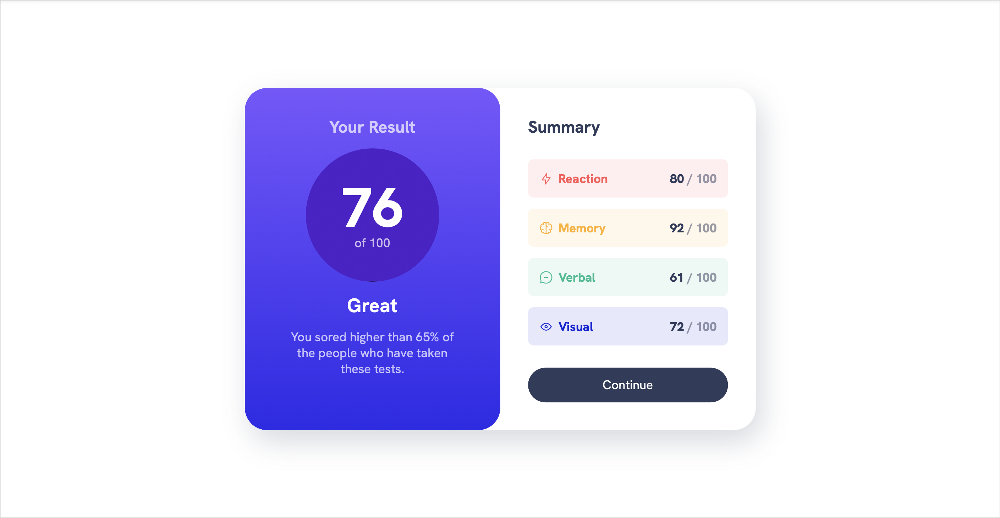
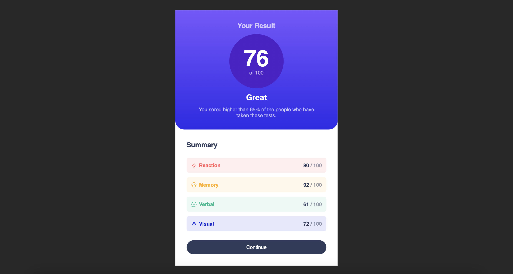

# Frontend Mentor - Results summary component solution

This is a solution to the [Results summary component challenge on Frontend Mentor](https://www.frontendmentor.io/challenges/results-summary-component-CE_K6s0maV). Frontend Mentor challenges help you improve your coding skills by building realistic projects. 

## Table of contents

- [Overview](#overview)
  - [The challenge](#the-challenge)
  - [Screenshot](#screenshot)
  - [Links](#links)
- [My process](#my-process)
  - [Built with](#built-with)
  - [What I learned](#what-i-learned)
  - [Continued development](#continued-development)
  - [Useful resources](#useful-resources)
- [Author](#author)
- [Acknowledgments](#acknowledgments)

## Overview

### The challenge

Users should be able to:
- View the optimal layout for the interface depending on their device's screen size
- See hover and focus states for all interactive elements on the page

### Screenshot(s)




### Links

- Solution URL: [My Solution](https://github.com/dashaunn/FEM-Results-Summary-Component/tree/main)
- Live Site URL: [Live Site URL](https://dashaunn.github.io/FEM-Results-Summary-Component/)

## My process

### Built with

- Semantic HTML5 markup
- CSS custom properties
- CSS flexbox
- CSS grid
- Media queries

### What I learned

1. CSS Custom Properties:
I've learned how to define and use CSS variables using the ':root' selector. These variables make it easy to manage and customize styles throughout the project.
```css
:root {
    --clr-primary-hsl-400: 252, 100%, 67%;
    --clr-neutral-hsl-100: 0, 0%, 100%;
    --fs-400: 1.125rem;
}
```
2. Media Queries for Responsive Design:
I've learned how to use media queries to apply different styles based on the screen size. This ensures that the website is responsive and looks good on various devices.
```css
@media (min-width: 600px) {
    /* Styles for screens with a minimum width of 600px */
}
```
3. Gradient Backgrounds
I've learned how to create gradient backgrounds using CSS, which can add depth and visual appeal to elements like buttons.
```css
.button:hover,
.button:focus-visible {
    background: var(--gradient-primary);
}
```
4. Styling SVGs and Images
I've learned how to ensure that images and SVGs are displayed correctly with maximum width and other styles applied.
```css
.flex-group {
    display: flex;
    /* Flexbox styles */
}
```
5. Consistent Typography
I've learned how to maintain consistent typography by using custom font variables for font sizes and weights.
```css
body {
    font-family: var(--font-family-default);
    font-size: var(--fs-400);
}
```

### Continued development

Where I want to focus in my future projects:
- CSS custom properties
- CSS Grid
- CSS preprocessors like SASS
- Responsive Design
- Web Accessibility

### Useful resources

- [Example resource 1](https://developer.mozilla.org/en-US/docs/Web/CSS/--*) - This article simply helped me to understand how custom properties/css variables work.

## Author

- Frontend Mentor - [@dashaunn](https://www.frontendmentor.io/profile/dashaunn)

## Acknowledgments

Huge thank you to Kevin Powell for help understanding css variables!